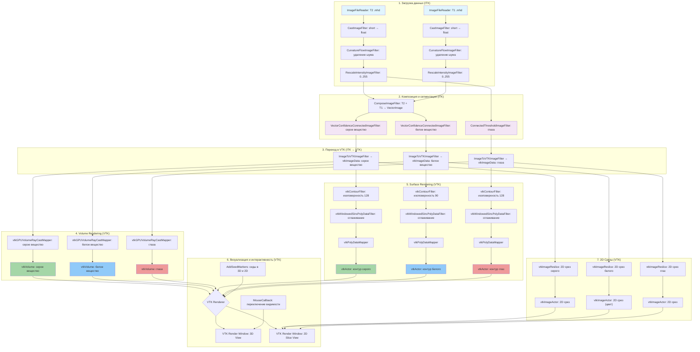

# 3D Brain Segmentation using ITK + VTK

## Автор
Щербаков Павел, группа 3825М1ПМвм1

## Описание
Проект реализует алгоритмы 3D-сегментации данных компьютерной томограммы для выделения следующих структур:
- Глаза
- Серое вещество
- Белое вещество

## Функциональность
- Обработка 3D данных томографии
- Сегментация на основе алгоритмов ITK
- Визуализация результатов с использованием VTK

Реализована возможность включения/выключения частей сегментации по нажатию на кнопки ON/OFF.
Во вспомогательном окне размещена информация о сегментированном срезе с наложенным исходным срезом.

## Технологии
- **Язык программирования**: C++
- **Библиотеки**:
  - [ITK](https://itk.org/) — для обработки и сегментации медицинских изображений
  - [VTK](https://vtk.org/) — для визуализации 3D-данных

## Структура проекта
Весь проект реализован в одном файле main.cpp

## Весь пайплайн обработки

